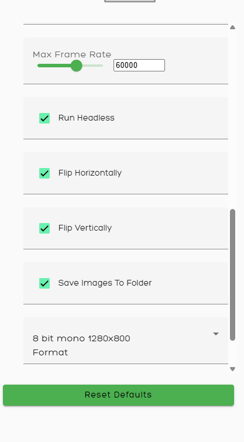
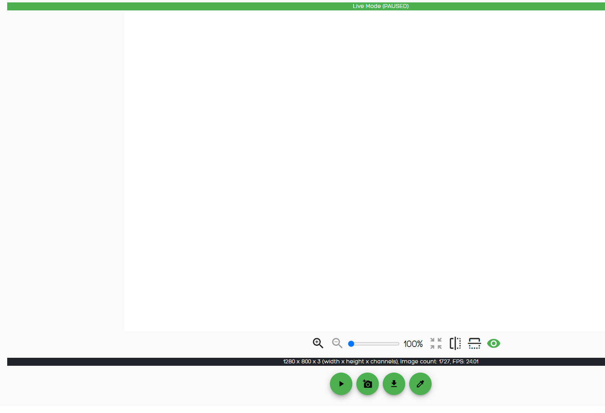

# Recording at 60 FPS

This guide describes how to capture a 60 FPS image sequence to disk using the camera controls.

## Required Settings

Open the camera control panel and configure the following:

1. **Max Frame Rate** — set to `60000`.
2. **Run Headless** — enable this checkbox. It stops the frontend from consuming frames for live display, which is required to sustain 60 FPS capture.
3. **Save Images To Folder** — enable this checkbox. This writes every captured frame to disk instead of (or in addition to) forwarding it.

The pixel format (e.g. `8 bit mono 1280x800`) can be left at its configured value; it does not need to change for 60 FPS recording.



## Where the images are stored

Captured frames are written to:

```
/mnt/data
```

On disk, each frame is saved as a JPEG named after its capture timestamp:

```
frame_<seconds>_<microseconds>.jpg
```

For example:

```
frame_119_832350.jpg
frame_119_876288.jpg
frame_119_920218.jpg
```

`/mnt/data` is bind-mounted into the camera container as its save folder, so files appear there as soon as they are written. The same folder is also exposed read-only over FTP (`liveviewImages`), so the sequence can be pulled off the device without a direct filesystem login.

## Live Mode button (not required for this workflow)

The **Live Mode** button (bottom toolbar in the image viewer) toggles a separate preview mode where frames are pulled and displayed one at a time, without continuously streaming them to the frontend.



This mode is useful for spot-checking individual frames, but it is **not needed** for the 60 FPS recording workflow above — leave **Run Headless** and **Save Images To Folder** enabled and let the capture run to disk.
